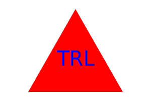

# SVG-Logo-Maker

## Description

This project was created so the user is able to generate a simple SVG logo. 
It utilizes the inquierer to recieve the user input for the logo generation, the app will ask the user for:
    - Text inside the shape
    - Color of text
    - Select the shape (Circle, Triangle, Square)
    - Color of the shape

Output: logo.svg file with the logo generated.

## Installation

To install this project the user will need to have Node.js installed, as well as inquirer and Jest module, which can be downloaded in the terminal using node itself. Once that’s done the user will need to clone this repo and run index.js from the terminal.

## Usage

This project can be used to create svg Logos using Node.js. 
For a video on how to use the application and how the application works please click on the following link: https://drive.google.com/file/d/1So04k4qJW2XXCx6DH5TtspFKr9MYIrwH/view?usp=share_link

## Contribution

This project is done, but users can contact me through email if they wish to provide any feedback or suggestions on how the project can be further improved

## Testing

To run unit testing the user can use: npm run test

## Contact Information

    GitHub: boro101094
    Email: boro101094@gmail.com

## Screenshots

Circle Example

Square Example

Triangle Example

